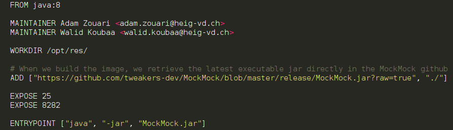

# MailPrankRobot
*Contributors : [Adam Zouari](https://github.com/AdamZouari) and [Walid Koubaa](https://github.com/zedsdead95)*
## Presentation

MailPrankRobot is a client application (TCP) in Java. It allows you to plays pranks (forged e-mails) automatically on a list of victims. 
We could do it with **real SMTP server**, but the behaviour of these servers may change over time. It may also change depending on the network your are connected to (internal, ISP, other ISP). 
The main reason why a server might behave differently is the fight between mail administrators and **spammers**.
For these reason, our application is based on a **mocker server**.

## Mock Server

We have chosen the mock STMP server named [MockMock](https://github.com/tweakers-dev/MockMock/blob/master/README.md) for it.
It let us simulate real mail sending, and to see what they look like in a web interface. The mails doesn't reach the recipient. This is a solution to simplify integration testing by using fake server.

### Setting up 

To install and run MockMock, you can download the jar file [here](https://github.com/tweakers-dev/MockMock/blob/master/release/MockMock.jar?raw=true). Extract it to any place you like and start the server by running: ``` java -jar MockMock.jar ``` (the defaults ports are 25 for smtp and 8282 for http)

Or you can just run our script ``` mockmock-docker.sh ``` that **run in deamon a docker container** who host the MockMock server with ports you want.

``` ./mockmock-docker.sh 2525 8080 ```
or without parameters to use defaults ports : ``` ./mockmock-docker.sh ```



