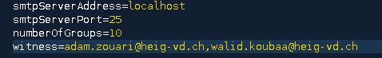
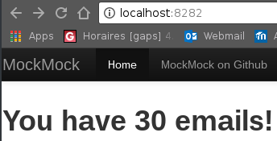

# MailPrankRobot
*Contributors : [Adam Zouari](https://github.com/AdamZouari) and [Walid Koubaa](https://github.com/zedsdead95)*
## Presentation

MailPrankRobot is a client application (TCP) in Java. It allows you to plays pranks (forged e-mails) automatically on a list of victims.  
We could do it with **real SMTP server**, but the behaviour of these servers may change over time. It may also change depending on the network your are connected to (internal, ISP, other ISP).  
The main reason why a server might behave differently is the fight between mail administrators and **spammers**.  
For these reason, our application is based on a **mocker server**.

## Mock Server

We have chosen the mock STMP server named [MockMock](https://github.com/tweakers-dev/MockMock/blob/master/README.md) for it.
It let us simulate real mail sending, and to see what they look like in a web interface.  The mails doesn't reach the recipient. 
This is a solution to simplify integration testing by using fake server.

### Setting up the server

To install and run MockMock:
- you can download the jar file [here](https://github.com/tweakers-dev/MockMock/blob/master/release/MockMock.jar?raw=true). Extract it to any place you like and start the server by running: ``` java -jar MockMock.jar ```.

- Or you can just run our script ``` mockmock-docker.sh ``` that **build and run in deamon a docker container** based on our own image available on DockerHub [adamzouari/mockmockservermail](https://hub.docker.com/r/adamzouari/mockmockservermail/). Take care of go into the cloned repo ``` cd Teaching-HEIGVD-RES-2018-Labo-SMTP/ ```
 - **without parameters to use defaults ports** : ``` ./mockmock-docker.sh ```
 - **specifiy ports smtp and http** (here 2525 and 8080 for example) : ```./mockmock-docker.sh 2525 8080 ```

port **http** : for the **web interface **  (default : 8282)
port **smtp** : for **listening client mail** (default 25)

- - -

## Mail Prank Generator

The mock server is running. You can go on the web interface to view the mails you've sent (no ones at the moment).


### Configure the client

Let's get into the heart of subject, now we must configure our tool to run a prank campaign.

Go to the config dir : ``` cd labo03-SMTP/config/ ```

- If you have **run the mock server with specifics ports**,   you must change the value of the **smtpServerPort** constant in ```config.properties ``` 
- In this same file you can choose **how many groups** in your pranks campaign will target, and how many persons contains a group.
By defaults it's 10 and 4 (1 sender and 3 receivers).

	


- You can add other victims in ``` victims.utf8 ```

- or other mails models in ``` messages.utf8 ``` where each mail is composed of the subject and content. Each mail separated by ```===``` 

## Specify witnesses

You can also specify which emails should receive the prank in CC (as a copy) so that these emails would be ```witnesses``` of the pranks sent.
To do so, you can modify in the ```config.properties``` file, the witnesses you have chosen.

	

## Before sending Mails

Before sending your prank emails, open a browser and connect to ```localhost:8282``` (or modify 8282 by your specified port in ```config.properties```).

You'll get, before lauching the client (with only the server running), an interface showing you that no mail is received. 

	

### Launch the client

You should run the client by executing the following shell ```client.sh``` on your Terminal with the command : 

	./client.sh

Your client is now connected to the mockmock-server and your prank mails have been sent ! Congratulations !

## Receive Mails

Once your client launched, you can see that your mails have been sent with the same steps as Before sending email,
by opening a browser and connect to ```localhost:8282``` (or modify 8282 by your specified port in ```config.properties```).

You can normally see that some mails were sent and you can easily see all the datas and headers of a basic SMTP protocol.

	
	
You are done ! You successfully simulated an SMTP server to send various and funny mails to differents receivers.
If you havec some question about the implementation or some improvements you think would make our mock server far better do not hesitate, we would be pleased.


